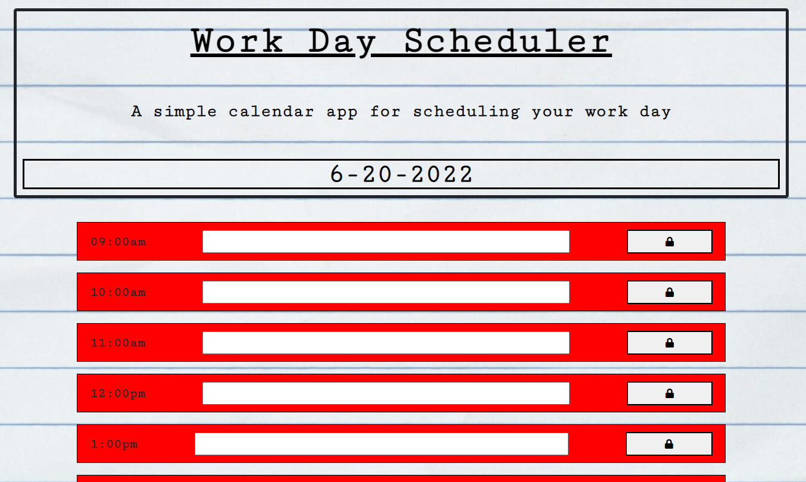

# Work-Day-Scheduler

[Deployed Link]: https://n7-gil.github.io/Work-Day-Scheduler/

The purpose of this assignment was to create a fully functional scheduler to plan out your day. The date on top automatically changes due to the moment function in javascript/jquery. The columns themselves automatically change color depending on the time of the day. If the hour passed the current hour of use, the color of the column would change to red. If it is the current time it will be grey. And if the plan is for a future time it would display green. The blocks/columns themselves were all made directly in javascript instead of being hard coded in the index. This would help add/delete extra columns if needed by simply adding onto the "timeHour" variable.

[Work-Day-Scheduler]: https://github.com/n7-gil/Work-Day-Scheduler

